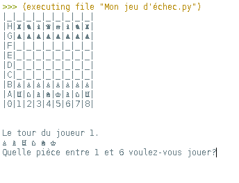

# Jeu Echec codé en python

## Description

Jeu d'échec 1 VS 1 sur console sans IA. 
Pour jouer au jeu, il est nécessaire d'entrer au clavier le type de pièce que l'on veut déplacer puis sa position et enfin son arrivé (exemple : 2B-2C )

## Présentation

-Environnement

-Apparence du jeu

